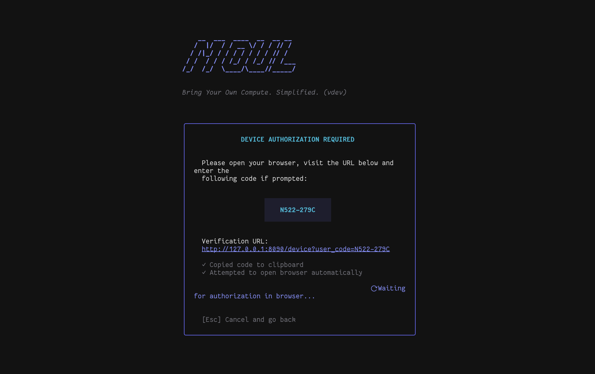

# Moul



`mould` is a lightweight, self-contained dynamic database, authentication, and background job processing engine in Go, inspired by PocketBase and Elixir's Oban.

---

## Table of Contents

- [Key Features](#key-features)
- [Technical Stack](#technical-stack)
- [Local Development Guide](#local-development-guide)
  - [Prerequisites](#prerequisites)
  - [Environment Configuration](#environment-configuration)
  - [Run Local Server](#run-local-server)
  - [Live Reloading (Hot Reload)](#live-reloading-hot-reload)
  - [Local S3 Storage (MinIO)](#local-s3-storage-minio)
  - [Testing & Verification Flows](#testing--verification-flows)
- [Documentation & API Specification (`/docs`)](#documentation--api-specification-docs)
  - [Interactive Runtime `/docs` Endpoint](#interactive-runtime-docs-endpoint)
  - [OpenAPI Specification Files](#openapi-specification-files)
  - [Embedded OpenAPI Spec in Go](#embedded-openapi-spec-in-go)
- [Web Admin Console (`/_moul_/`)](#web-admin-console-_moul_)
  - [Overview](#web-admin-overview)
  - [Frontend Architecture & Stack](#frontend-architecture--stack)
  - [Local UI Development & Live Reloading](#local-ui-development--live-reloading)
  - [Single-Binary Embedding in Production](#single-binary-embedding-in-production)
- [Moul TUI Admin Console (`moul`)](#moul-tui-admin-console-moul)
  - [Overview](#overview)
  - [Build and Run](#build-and-run)
  - [Connection Setup & Config Storage](#connection-setup--config-storage)
  - [TUI Features & Capabilities](#tui-features--capabilities)
  - [Keyboard Controls Guide](#keyboard-controls-guide)
- [Programmatic Go API](#programmatic-go-api)
  - [1. Register and Start Worker Engine](#1-register-and-start-worker-engine)
  - [2. Enqueue Job Programmatically from Go](#2-enqueue-job-programmatically-from-go)
  - [3. Programmatic Analytics API](#3-programmatic-analytics-api)
- [Worker Engine Architecture & Operations](#worker-engine-architecture--operations)
- [Access Rules & Filters Syntax](#access-rules--filters-syntax)
- [Deployment Information](#deployment-information)
  - [Single-Binary Production Build](#single-binary-production-build)
  - [Production Environment Variables](#production-environment-variables)
  - [Litestream Automated S3 Backup & Disaster Recovery](#litestream-automated-s3-backup--disaster-recovery)
  - [Systemd Service Deployment Example](#systemd-service-deployment-example)
  - [Production Deployment with LXD, Tailscale & Cloudflare Tunnel](#production-deployment-with-lxd-tailscale--cloudflare-tunnel)

---

## Key Features

1. **Dynamic Moul (Tables)**: Create, list, update, and delete database tables and schemas at runtime via HTTP API or TUI.
2. **Dynamic Record CRUD**: Perform complete CRUD operations on any dynamic moul using raw JSON payloads governed by HCL-like authorization rules.
3. **Multi-Factor & Modern Auth**: Built-in support for Password, Email OTP, WebAuthn Passkeys, Social OAuth2 (GitHub, Google, Apple), and OAuth2 Device Flow.
4. **Rule Authorization Engine**: Enforce robust access rules (e.g. `@request.auth.id != ""` or `@collection.user_roles.user_id = @request.auth.id`) dynamically, featuring datetime macros, field modifiers, wildcard matching, and database helper functions.
5. **Background Worker Engine**: High-performance, SQLite-backed asynchronous background job processor (inspired by Elixir's Oban) with queue priorities, automatic retries with exponential backoffs, and immediate dispatch triggers.
6. **Single Binary SQLite**: Driven by `github.com/pocketbase/dbx` and the CGO-free `modernc.org/sqlite` driver for lightweight, zero-configuration local development and deployment.
7. **First-Party Analytics & Session Tracking**: Create `analytic` moul that automatically track events and sessions. Parses client headers (IP, User-Agent, Referrer, UTM parameters) to resolve browser, OS, device, referring domain, and marketing campaign parameters, including optional MaxMind GeoIP2 resolution.
8. **Default Request Tracking**: All HTTP requests are automatically tracked via a global middleware. Visitor sessions are deduplicated in `_visits`, and per-request data (method, path, status code, response time) is batch-inserted asynchronously into `_requests` for zero-latency-impact observability.
9. **TUI Admin Console**: Full-featured Terminal User Interface (TUI) built with Charm's Bubble Tea to manage schemas, records, worker queues, analytics, email templates, and system settings without requiring a browser.
10. **Feature Flags & OpenFeature SDK**: Integrated OpenFeature Go SDK provider with multi-level gate targeting (master boolean switches, actor overrides, dynamic group rules, and deterministic percentage rollouts) backed by SQLite storage and fast thread-safe in-memory caching.
11. **Native Host System Monitoring**: Lightweight, zero-dependency host system metrics collector (CPU, memory, disk space, goroutines, system load) for real-time observability in the TUI console and REST API.
12. **Outbound HTTP Webhooks**: Configure outbound HTTP webhooks per collection with granular event triggers (`create:before`, `create:after`, `update:before`, `update:after`, `delete:before`, `delete:after`, or wildcard `*`). Supports synchronous before-hooks that can reject/abort database operations on error, asynchronous background after-hooks, and HMAC-SHA256 payload signature verification (`X-Moul-Signature`).
13. **Real-time SSE Record Subscriptions**: High-performance, lock-optimized Server-Sent Events (SSE) subscriptions via `GET /api/moul/:name/subscribe`. Frontend clients react instantly to record changes (`create`, `update`, `delete`) without polling, complete with event filtering, single-record targeting, and `subscribeRule` security checks.
14. **Built-in MCP Server**: Native Model Context Protocol (MCP) server providing AI agents (Claude Desktop, Cursor, custom assistants) full inspection and control over collections, record CRUD, background workers, feature flags, and system metrics via stdio (`mould mcp`) and HTTP SSE (`/api/mcp`).

---

## Technical Stack

- **HTTP Framework**: [Echo v5](https://echo.labstack.com)
- **Feature Flag SDK**: [OpenFeature Go SDK](https://github.com/open-feature/go-sdk) (with `fun_with_flags` gate engine)
- **Host System Monitoring**: Native Go runtime & system metrics sampling
- **Database Abstraction**: [pocketbase/dbx](https://github.com/pocketbase/dbx)
- **SQLite Driver**: [modernc.org/sqlite](https://github.com/modernc/sqlite) (Pure Go, CGO-free)
- **TUI Framework**: [Charm Bubble Tea](https://github.com/charmbracelet/bubbletea), [Bubbles](https://github.com/charmbracelet/bubbles), [Lip Gloss](https://github.com/charmbracelet/lipgloss)
- **Expression Engine**: [expr-lang/expr](https://github.com/expr-lang/expr)
- **JWT Handling**: [golang-jwt/jwt](https://github.com/golang-jwt/jwt)
- **Database Replication / Backup**: [Litestream](https://litestream.io/) (Embedded Go S3 replication)
- **Structured Logging**: Standard library `log/slog`

---

## Local Development Guide

### Prerequisites

- **Go**: Version 1.26 or higher
- **Air** *(Optional, for live reload)*: Install via `go install github.com/air-verse/air@latest` or `brew install air`
- **MinIO & MinIO Client (`mc`)** *(Optional, for local S3 testing)*: `brew install minio minio-client` on macOS

### Environment Configuration

The engine reads environment variables from a `.env` file in the project root if present. Default environment setup for local development:

```env
MOUL_ENV=development
MOUL_PORT=8090
MOUL_JWT_SECRET=test-secret-key-for-unit-tests-1234
MOUL_ADMIN_KEY=test-admin-key-1234
MOUL_DB_PATH=moul-local.db
```

### Run Local Server

Start the Echo HTTP server and background worker engine on port `:8090` (this automatically creates or opens the local SQLite database file `moul-local.db`):

```bash
make run
# Or directly via Go:
go run cmd/mould/main.go start
```

### Live Reloading (Hot Reload)

For active local development with instant code recompilation on change:

```bash
make dev
# Runs air using .air.toml
```

### Local S3 Storage (MinIO)

For testing file uploads and Litestream database backups locally against an S3 API:

1. **Start MinIO server**:
   ```bash
   make minio-start
   ```
   Starts MinIO server storing data in `tmp/minio` (Console available at [http://localhost:9001](http://localhost:9001), credentials: `minioadmin` / `minioadmin`).

2. **Configure MinIO Client (`mc`)**:
   In a separate terminal, register the `moul-local` alias:
   ```bash
   make minio-setup
   ```

3. **Create Storage Buckets**:
   ```bash
   mc mb moul-local/moul-bucket
   mc mb moul-local/moul-litestream
   ```

### Testing & Verification Flows

`mould` includes unit tests, integration tests, and automated cURL verification flows.

#### 1. Unit & Integration Tests
```bash
# Run all Go package tests
make test-go

# Run tests with code coverage output
make test-coverage

# Run TUI tests
make test-tui
```

#### 2. Automated cURL Flow Scripts
Ensure the server is running (`make run`) in a separate terminal before executing flow tests:

- **Verify Dynamic CRUD, Auth, and Rules Enforcement**:
  ```bash
  make test-flow
  ```
- **Verify Asynchronous Background Worker Queue**:
  ```bash
  make test-worker
  ```
- **Verify First-Party Analytics and Visit Resolution**:
  ```bash
  make test-analytics
  ```

---

## Documentation & API Specification (`/docs`)

`mould` maintains an accurate OpenAPI 3.0 specification serving interactive API documentation directly from the running engine.

### Interactive Runtime `/docs` Endpoint

When the server is running (`make run`), interactive API documentation is accessible in your browser:

- **Scalar API Reference (Default)**: [http://localhost:8090/docs](http://localhost:8090/docs)
- **Swagger UI**: [http://localhost:8090/docs?ui=swagger](http://localhost:8090/docs?ui=swagger)

### OpenAPI Specification Files

The OpenAPI spec is available in both YAML and JSON formats for exporting to Postman, Insomnia, or API SDK generator tools:

- **YAML Spec**: [http://localhost:8090/openapi.yml](http://localhost:8090/openapi.yml) (or `/docs/openapi.yml`)
- **JSON Spec**: [http://localhost:8090/openapi.json](http://localhost:8090/openapi.json) (or `/docs/openapi.json`)
- **Repository File**: [`docs/openapi.yml`](docs/openapi.yml)

### Embedded OpenAPI Spec in Go

The specification file is embedded into the compiled binary via Go's `//go:embed openapi.yml` directive in [`docs/docs.go`](docs/docs.go). This ensures single-binary deployments serve live API docs without requiring external static asset files.

### Extensibility & Custom Workers

- **Worker Extensibility Guide**: [`docs/worker-extensibility.md`](docs/worker-extensibility.md) - Learn how to build custom `mould` binaries with custom background job handlers and periodic tasks using `pkg/app`.
- **Example Binary**: [`examples/custom-worker/main.go`](examples/custom-worker/main.go) - A runnable code example of an embedded Mould application.

---

## Web Admin Console (`/_moul_/`)

<a id="web-admin-overview"></a>
### Overview

`mould` features a high-performance, single-binary **Web Admin Console** mounted at `/_moul_/` (with automatic redirects from `/admin` and `/_moul_`). It provides a rich, responsive browser-based dashboard to manage collection schemas, dynamic records, real-time SSE subscriptions, analytics, background worker queues, feature flags, and server settings.

### Frontend Architecture & Stack

- **UI Component System**: **Moul UI (`@moul-dev/ui`)** built on **React Aria Components** and **StyleX** for accessible, zero-runtime atomic UI components.
- **Background Worker Engine & Jobs Queue Monitor**: Real-time worker jobs queue table with status filters (`available`, `executing`, `completed`, `retryable`, `discarded`), execution attempt metrics, job payload inspector drawer, and instant **Retry** and **Discard** actions.
- **Visual Telemetry & Analytics Dashboard**: Built-in interactive **AreaChart** (requests over time categorized by success vs error) and **TopList** (top endpoints & referrers) powered by `@moul-dev/ui` alongside live server latency, throughput, and error rate stats.
- **Real-Time Stream Viewer**: Server-Sent Events (SSE) listener integrated with `@moul-dev/ui`'s high-performance **`Logs` stream viewer** with syntax highlighting, search/level filters, drawer payload inspector, and auto-scroll follow.
- **Feature Flag Evaluation Playground**: Live evaluation sandbox to test flag targeting gates, percentage rollouts, and actor/group targeting rules against customizable JSON contexts with instant reason code breakdowns.
- **Settings Unsaved State Protection**: Form divergence tracking (`isDirty`) with visual warning badges and `AlertDialog` confirmation guards protecting against accidental loss when configuring S3, Litestream, rate limits, OAuth, or email.
- **Actionable Dashboard & Live Collection Metrics**: Engine overview with live record count badges per schema and quick "+ New Record" actions.
- **Relational Association Modeling**: Complete visual relationship builder directly in Schema Designer supporting **1:1 (One-to-One)**, **1:N (Many-to-One / Foreign Key)**, **M:N (Many-to-Many)**, self-referencing tree structures, on-delete referential integrity policies (`CASCADE`, `SET_NULL`, `RESTRICT`), and interactive linked record pickers with inline relation expansion.
- **Theming**: Tri-state theme toggle supporting **System** (default, dynamically adapting to OS preference in real-time), **Light**, and **Dark** modes with persistent storage.
- **Routing**: **TanStack Router** with file-based routing (`ui/src/routes/`), generated type-safe route trees, typed Zod search schemas, route loaders, intent preloading (`preload: 'intent'`), and automatic code splitting.
- **Styling**: **Meta StyleX (`@stylexjs/stylex`)** with `@stylexjs/unplugin` for zero-runtime / compile-time atomic CSS-in-JS and dedicated design tokens (`@moul-dev/ui/tokens.stylex`).
- **Data & Tables**: **TanStack Query (`@tanstack/react-query`)** for asynchronous state caching and server synchronization.
- **Iconography**: **Phosphor Icons (`@phosphor-icons/react`)**.

### Local UI Development & Live Reloading

For frontend development with instant Hot Module Replacement (HMR) and API proxying:

```bash
# 1. Install frontend dependencies
make ui-install

# 2. Start the mould backend engine in one terminal
make run

# 3. Start the Vite dev server in another terminal (proxies /api to localhost:8090)
make ui-dev
```

Open [http://localhost:5173/_moul_/](http://localhost:5173/_moul_/) in your browser.

### Single-Binary Embedding in Production

In production, the compiled SPA bundle is embedded directly into the Go binary at compile time via Go's `//go:embed all:dist` directive in [`internal/ui/ui.go`](internal/ui/ui.go).

```bash
# Build standalone mould binary with embedded docs and Web Admin Console
make build

# Start single-binary server
./bin/mould start
```

Access the Web Admin Console at [http://localhost:8090/_moul_/](http://localhost:8090/_moul_/). All HTML5 SPA sub-routes (e.g. `/_moul_/collections/posts`, `/_moul_/settings`) are resolved seamlessly via Echo's embedded SPA fallback router.

---

## Moul TUI Admin Console (`moul`)

### Overview

`moul` comes with a modern, self-contained Terminal User Interface (TUI) built with Charm's **Bubble Tea** ecosystem (`bubbletea`, `bubbles`, `lipgloss`). It provides full administration over your engine directly from the command line without opening a browser.


### Build and Run

#### Run via Go
```bash
make tui
# Or:
go run cmd/moul/main.go
```

#### Build Compiled TUI Binary
```bash
make build-tui
./bin/moul
```

### Connection Setup & Config Storage

On initial startup, `moul` prompts for connection credentials:
1. **Server URL**: Server address (defaults to `http://localhost:8090`).
2. **Admin Key**: The security key configured on the server (`MOUL_ADMIN_KEY`).

Credentials and connection state are securely saved to `~/.config/moul.json` (with fallback to system keyring where available) for automatic re-connection on subsequent launches.

### TUI Features & Capabilities

- **Dashboard**: High-level system overview displaying collection counters, active workers, visit statistics, and quick system links.
- **Real-Time Inline Form Validation**: Built-in validation for email format, password requirements (minimum 8 characters with confirmation matching during root setup and Auth collection record creation), URLs, numeric inputs, and JSON syntax.
- **Collection Schema Management**: Create new collections (`base`, `auth`, `worker`, `analytic`), add/remove fields, choose field types, and write HCL access control rules.
- **Dynamic Record CRUD Console**: Browse collection records with pagination (`>` / `<`), live search and server-side filtering (`/`), inspect JSON payloads, copy payload directly to clipboard (`c`), add new records, edit existing records, and delete records.
- **Background Workers Monitor**: Real-time 3-second auto-refreshing monitor of background job queues (`executing`, `available`, `completed`, `discarded`). Inspect job parameters, copy details (`c`), force-retry failed jobs (`r`), or discard jobs (`c`).
- **Analytics & Visits Observatory**: Authenticate user credentials (`l`) to inspect live site visit logs (`_visits`) with date range filtering (`t`: All Time, 24h, 7d, 30d), OS, browser, device type, resolved GeoIP location, landing page, and UTM campaign tracking parameters.
- **Email Templates Editor**: Customize transactional email templates (OTP verification, Password Reset) per auth collection and send live test emails.
- **System Settings Panel**: Comprehensive configuration over dynamic system areas with instant server-side hot-reloading (`POST /api/admin/reload` or `R` in TUI): S3 Object Storage, Litestream Continuous Backups, Sliding Window Rate Limiting Rules, Root User IP Whitelist, Transactional Email Delivery (SES, Resend, Mailgun, SendGrid, Cloudflare, Console), OAuth2 Identity Providers (GitHub, Google, Apple), and Root Administrator Credentials.

### Keyboard Controls Guide

| Screen | Key | Action |
| :--- | :--- | :--- |
| **Global** | `ctrl+c` | Exit program |
| **Connection Screen** | `Tab` / `Shift+Tab` | Navigate inputs |
| | `Enter` | Connect to server |
| **Dashboard** | `↑`/`↓` or `k`/`j` | Navigate collections and options |
| | `Enter` / `l` / `→` | Open selected item |
| | `r` | Refresh schema list from server |
| | `Esc` | Disconnect and return to login screen |
| **Record List** | `↑`/`↓` or `k`/`j` | Scroll record list |
| | `>` / `<` (or `.` / `,`) | Next / Previous page |
| | `/` | Activate live search & filter query |
| | `Enter` / `v` | Inspect detailed JSON payload |
| | `n` | Create new record |
| | `e` | Edit selected record |
| | `d` | Delete selected record |
| | `r` | Refresh record list |
| | `Esc` / `h` / `←` | Clear filter or return to dashboard |
| **Record Detail / Job Detail** | `c` | Copy JSON payload to OS clipboard |
| | `↑`/`↓` or `k`/`j` | Scroll payload viewport |
| | `Esc` / `q` / `h` | Return to list |
| **Worker Monitor** | `↑`/`↓` or `k`/`j` | Scroll job queue (auto-refreshes every 3s) |
| | `Enter` / `v` | View job details & stack trace |
| | `r` | Force-retry failed job |
| | `c` | Discard/cancel job |
| | `f` | Refresh worker status immediately |
| | `Esc` | Back to dashboard |
| **Analytics Console** | `l` | Log in user to retrieve JWT token |
| | `t` / `d` | Cycle date range (All Time, 24h, 7d, 30d) |
| | `↑`/`↓` or `k`/`j` | Scroll visit logs |
| | `Enter` / `v` | View visit metadata & UTM details |
| | `f` | Refresh visits |
| | `Esc` | Back to dashboard |
| **Settings Panel** | `←`/`→` | Switch settings tabs or toggle Save/Cancel |
| | `↑`/`↓` or `Tab` | Navigate settings fields |
| | `Space` / `Enter` | Toggle booleans or submit form |
| | `R` | Hot-reload running server runtime settings |
| | `Esc` | Back to dashboard |

---

## Programmatic Go API

In addition to HTTP endpoints, backend processing and custom background worker tasks can be implemented programmatically in Go.

### 1. Register and Start Worker Engine

```go
import (
	"context"
	"github.com/moul-dev/moul-dev/internal/worker"
)

// 1. Initialize worker engine
workerEngine := worker.NewEngine(dbConn)

// 2. Register custom execution handler
workerEngine.Register("SendEmail", func(ctx context.Context, job *worker.Job) error {
	to := job.Args["to"].(string)
	subject := job.Args["subject"].(string)
	
	// Execute custom background logic...
	println("Sending email to " + to)
	return nil
})

// 3. Start processing loop with context cancellation
ctx, cancel := context.WithCancel(context.Background())
defer cancel()
workerEngine.Start(ctx)
defer workerEngine.Stop() // Gracefully awaits running tasks to complete
```

### 2. Enqueue Job Programmatically from Go

```go
jobOpts := map[string]interface{}{
	"worker": "SendEmail",
	"priority": 1,
	"args": map[string]interface{}{
		"to": "user@example.com",
		"subject": "System Alert",
	},
}

job, err := workerEngine.Enqueue(context.Background(), "background_tasks", jobOpts)
```

### 3. Embedding `pkg/app` with Custom HTTP Routes and Workers

`pkg/app` allows embedding the complete `mould` server into custom Go binaries with tailored HTTP endpoints and background workers:

```go
package main

import (
	"context"
	"net/http"

	"github.com/labstack/echo/v5"
	"github.com/moul-dev/moul-dev/pkg/app"
)

func main() {
	mouldApp := app.New(app.Config{Version: "1.0.0-custom"})

	// Register custom HTTP route
	mouldApp.RegisterRoute("GET", "/api/custom/ping", func(c *echo.Context) error {
		return c.JSON(http.StatusOK, map[string]string{"status": "pong"})
	})

	// Access raw Echo router via hook
	mouldApp.OnRouterInit(func(router *echo.Echo) error {
		router.GET("/api/custom/health", func(c *echo.Context) error {
			return c.String(http.StatusOK, "OK")
		})
		return nil
	})

	// Register custom background worker
	mouldApp.RegisterWorker("CustomTask", func(ctx context.Context, job *worker.Job) error {
		return nil
	})

	mouldApp.Start(context.Background())
}
```

Detailed guides:
- [Custom HTTP Route Extensibility Guide](docs/route-extensibility.md)
- [Worker Handler Extensibility Guide](docs/worker-extensibility.md)

### 4. Programmatic Analytics API

```go
import (
	"context"
	"github.com/moul-dev/moul-dev/internal/analytics"
)

params := &analytics.EventParams{
	VisitToken:   "visit-123",
	VisitorToken: "visitor-456",
	Name:         "payment_completed",
	Properties: map[string]interface{}{
		"amount": 99.9,
	},
}

event, err := analyticsEngine.Track(context.Background(), "events", params)
```

---

## Built-in Model Context Protocol (MCP) Server

`mould` includes a built-in MCP server powered by `github.com/mark3labs/mcp-go`. This allows AI assistants (Claude Desktop, Cursor, AI agents) to inspect, query, and manage your dynamic database, background jobs, feature flags, and host metrics.

### Transport Modes

1. **Stdio Transport Mode (`mould mcp`)**: Runs directly as a CLI subcommand over standard input/output.
2. **Streamable HTTP & SSE Mode (`/api/mcp`)**: Enabled automatically on `mould start`. Supports direct JSON-RPC POST requests (MCP 2025 Spec) and SSE streaming.
3. **Flexible Authentication**: Pass key via `X-Admin-Key` header, `Authorization: Bearer <MOUL_ADMIN_KEY>`, or URL query parameter `?adminKey=<MOUL_ADMIN_KEY>`.

### Integration Examples

#### Stdio Mode (Claude Desktop, Cursor, Antigravity)

**Claude Desktop Configuration (`claude_desktop_config.json`)**:
```json
{
  "mcpServers": {
    "mould": {
      "command": "/path/to/mould",
      "args": ["mcp"],
      "env": {
        "MOUL_DB_PATH": "/path/to/moul-local.db"
      }
    }
  }
}
```

**Cursor IDE (`.cursor/mcp.json`)**:
```json
{
  "mcpServers": {
    "mould": {
      "command": "mould",
      "args": ["mcp"]
    }
  }
}
```

#### Streamable HTTP / SSE Mode (`http://localhost:8090/api/mcp`)

**Header Authentication**:
```json
{
  "mcpServers": {
    "mould-http": {
      "url": "http://localhost:8090/api/mcp",
      "headers": {
        "X-Admin-Key": "test-admin-key-1234"
      }
    }
  }
}
```

**URL Query Parameter Authentication**:
```json
{
  "mcpServers": {
    "mould-http": {
      "url": "http://localhost:8090/api/mcp?adminKey=test-admin-key-1234"
    }
  }
}
```

### Available MCP Tools

| MCP Tool Name | Description |
|---|---|
| `moul_list_collections` | List all dynamic collection schemas and tables |
| `moul_get_collection` | Get detailed field schema and rules for a collection |
| `moul_create_collection` | Create a new dynamic collection schema and SQLite table |
| `moul_delete_collection` | Delete a collection and drop its physical table |
| `moul_list_records` | Query paginated records from any collection |
| `moul_get_record` | Retrieve a single record by ID |
| `moul_create_record` | Insert a new dynamic record |
| `moul_update_record` | Update an existing record |
| `moul_delete_record` | Delete a record by ID |
| `moul_list_worker_jobs` | List background jobs by status/queue |
| `moul_enqueue_job` | Enqueue a new background job |
| `moul_cancel_job` | Cancel a pending or retryable worker job |
| `moul_list_feature_flags` | List all feature flags and gate rules |
| `moul_set_feature_flag` | Create or update a feature flag |
| `moul_get_system_metrics` | Fetch host CPU, Memory, Disk, and Load metrics |
| `moul_get_analytics_summary` | Fetch visitor and request analytics totals |
| `moul_list_requests` | Query recent HTTP request logs |

---

## Outbound HTTP Webhooks

Moul collections support outbound HTTP webhooks registered per collection to enable integrations with external automation tools and services.

### Event Triggers & Hook Lifecycles

- **`*:before` Hooks** (`create:before`, `update:before`, `delete:before`): Executed **synchronously** before physical database operations. If the target webhook returns a non-2xx HTTP status code or fails to respond within 5s timeout, the record operation is rejected and an error is returned to the client.
- **`*:after` Hooks** (`create:after`, `update:after`, `delete:after`): Executed **asynchronously** in the background after successful database operations without delaying client response latency.
- **Wildcard & Shorthand Matching**: Setting event `"create"` matches both `create:before` and `create:after`. Setting `"*"`, `""`, or `"all"` matches all events.

### Payload & Signature Format

Outbound webhook POST requests include the following headers and payload:
- `Content-Type: application/json`
- `X-Moul-Event`: Event trigger name (e.g. `create:before`)
- `X-Moul-Webhook-ID`: Unique webhook ID
- `X-Moul-Timestamp`: Event RFC3339 timestamp
- `X-Moul-Signature`: HMAC-SHA256 hex digest of payload body computed using the configured `secret` key.

**JSON Payload**:
```json
{
  "event": "update:after",
  "moul": "products",
  "record": { "id": "prod-123", "name": "Widget Updated", "price": 49.99 },
  "old_record": { "id": "prod-123", "name": "Widget", "price": 39.99 },
  "timestamp": "2026-07-31T19:54:08Z"
}
```

### Webhook Management Endpoints

- `GET /api/moul/:name/webhooks` - List all webhooks for a collection.
- `POST /api/moul/:name/webhooks` - Create a new webhook for a collection.
- `GET /api/moul/:name/webhooks/:id` - Get webhook configuration by ID.
- `PATCH /api/moul/:name/webhooks/:id` - Update webhook configuration by ID.
- `DELETE /api/moul/:name/webhooks/:id` - Remove a webhook by ID.
- `POST /api/moul/:name/webhooks/:id/test` - Trigger a ping test payload (`event: "ping"`) to verify webhook receiver connectivity.

---

## Real-time SSE Subscriptions

Moul provides high-performance real-time record subscriptions over Server-Sent Events (SSE). Frontend applications can open an SSE connection to react to record changes (`create`, `update`, `delete`) in real time without polling.

### Subscribing to Collection Events

- **Endpoint**: `GET /api/moul/:name/subscribe`
- **Query Parameters**:
  - `event`: Optional comma-separated list of event actions to filter (`create`, `update`, `delete`, or `*`). Default: `*`.
  - `id`: Optional filter for a specific record ID.
  - `token`: Optional JWT authorization token for browser `EventSource` clients.

### JavaScript Client Example

```javascript
const evtSource = new EventSource('/api/moul/posts/subscribe?token=' + userToken);

evtSource.addEventListener('create', (e) => {
  const data = JSON.parse(e.data);
  console.log('New post created:', data.record);
});

evtSource.addEventListener('update', (e) => {
  const data = JSON.parse(e.data);
  console.log('Post updated:', data.record);
});

evtSource.addEventListener('delete', (e) => {
  const data = JSON.parse(e.data);
  console.log('Post deleted:', data.record);
});
```

### Global Subscriptions

To subscribe across all collections or specific multi-collections, use `GET /api/moul/subscribe`:
`GET /api/moul/subscribe?mouls=posts,comments`

---

## Worker Engine Architecture & Operations

- **State Transitions**: Jobs navigate states (`available` -> `executing` -> `completed` / `discarded`). Historical execution records are retained for metric inspections.
- **Failures & Exponential Backoffs**: If a job handler returns an error or panics, the engine logs error details, increments `attempt`, and reschedules execution with an exponential backoff (`(attempt^2 * 10) + 10` seconds + jitter) until reaching `max_attempts` (default: 20), after which it transitions to `discarded`.
- **Immediate Dispatch**: Enqueuing a job via HTTP or Go API immediately signals the worker engine over an in-memory channel, executing available jobs without waiting for polling tickers.
- **Graceful Shutdown**: On OS interrupt signals (`SIGINT`/`SIGTERM`), worker fetching halts immediately while existing running task handlers are given a graceful timeout to finish execution cleanly.

---

## Data Modeling & Field Types

Moul supports 10 dynamic field types for schema definitions with automatic SQLite storage mapping, OpenAPI 3.0 type hints, and runtime validation:

| Field Type | Description | SQLite Storage | Validation & Constraints | OpenAPI Type / Format |
| :--- | :--- | :--- | :--- | :--- |
| `text` | Character string data | `TEXT` | Optional `min` and `max` character length | `type: string`, `minLength`, `maxLength` |
| `number` | Floating point or integer numeric values | `NUMERIC` | Optional `min` and `max` numeric bounds | `type: number`, `minimum`, `maximum` |
| `bool` | Boolean flag | `INTEGER` (`1`/`0`) | Validates boolean (`true`/`false`, `1`/`0`, `"true"`/`"false"`) | `type: boolean` |
| `date` | Date string | `TEXT` | Enforces `YYYY-MM-DD` ISO format | `type: string`, `format: date` |
| `datetime` | Date and time timestamp string | `TEXT` | Enforces ISO 8601 / RFC 3339 format | `type: string`, `format: date-time` |
| `json` | Arbitrary JSON object or array structure | `TEXT` | Validates valid JSON syntax; unmarshals back to JSON | `type: object` |
| `url` | Web address link string | `TEXT` | Enforces valid HTTP/HTTPS URL format | `type: string`, `format: uri` |
| `file` | File path or upload metadata | `TEXT` | Validates file metadata structure | `type: string` |
| `select` | Enum string with constrained allowed values | `TEXT` | Restricts value to one of predefined `options` | `type: string`, `enum: [...]` |
| `relation` | Foreign key association to another collection | `TEXT` | Validates target record existence (`1:1`, `1:N`, or `M:N` array) | `type: string` or `type: array` |

---

## Access Rules & Filters Syntax

Each Moul (table) supports five HCL-like expression rules evaluated on client API requests:
- `listRule` - Restricts records returned in collection list queries.
- `viewRule` - Controls access to view a single record by ID.
- `createRule` - Validates fields/permissions before record insertion.
- `updateRule` - Validates current record fields and incoming values before update.
- `deleteRule` - Validates permissions before record deletion.

### Rule Expression Syntax Reference

- **Request Context Variables**: `@request.auth.id`, `@request.body.fieldName`, `@request.headers.header_name`, `@request.query.paramName`, `@request.method`
- **Operators**: `=`, `!=`, `>`, `>=`, `<`, `<=`, `~` (LIKE/contains), `!~` (NOT LIKE)
- **Wildcard Array Modifiers**: `?=` (e.g. `allowed_users.id ?= @request.auth.id`)
- **Field Modifiers**: `:lower`, `:length`, `:isset`, `:changed`, `:each`
- **Helper Functions**: `geoDistance(lonA, latA, lonB, latB)`, `strftime(format, timeVal)`
- **Cross-Collection Join Queries**: `@collection.user_roles.user_id = @request.auth.id && @collection.user_roles.role = 'admin'`

---

## Deployment Information

### Single-Binary Production Build

`mould` compiles into a single, self-contained binary containing the HTTP engine, worker processor, embedded web docs, and CGO-free SQLite database driver.

To build the production binary with stripped debug symbols and version metadata:

```bash
make build
# Creates executable at bin/mould
```

### Production Environment Variables

Set the following environment variables on your production server or container:

| Variable | Required | Description | Example |
| :--- | :--- | :--- | :--- |
| `MOUL_ENV` | Yes | Application environment mode | `production` |
| `MOUL_ADMIN_KEY` | Yes | Master administrative secret key | `super-secret-admin-key-9988` |
| `MOUL_JWT_SECRET` | Yes | Secret key for signing JWT tokens | `jwt-secret-key-production-3344` |
| `MOUL_PORT` | No | HTTP listening port (default: 8090) | `8090` |
| `MOUL_PUBLIC_URL` | No | Base public URL for email links (default: http://localhost:8090) | `https://api.myapp.com` |
| `MOUL_DB_PATH` | No | Path to SQLite database file | `/var/lib/moul/moul.db` |
| `MOUL_CORS_ORIGINS` | No | Allowed CORS origins (comma-separated) | `https://myapp.com,https://admin.myapp.com` |
| `GEOIP_DB_PATH` | No | Path to MaxMind GeoIP2 `.mmdb` database | `/var/lib/moul/GeoLite2-City.mmdb` |

### Litestream Automated S3 Backup & Disaster Recovery

`mould` includes built-in [Litestream](https://litestream.io/) replication directly in the binary for real-time, point-in-time SQLite replication to S3-compatible cloud storage (AWS S3, MinIO, Cloudflare R2, DigitalOcean Spaces).

#### Enabling Replication in Production

To enable background replication, set the following environment variables before running `mould start`:

```env
LITESTREAM_ENABLED=true
LITESTREAM_S3_BUCKET=my-moul-backups
LITESTREAM_ACCESS_KEY_ID=YOUR_AWS_OR_S3_ACCESS_KEY
LITESTREAM_SECRET_ACCESS_KEY=YOUR_AWS_OR_S3_SECRET_KEY
LITESTREAM_REGION=us-east-1
# Optional for S3-compatible services (MinIO, R2, Cloudflare, DigitalOcean):
LITESTREAM_S3_ENDPOINT=https://s3.us-east-1.amazonaws.com
LITESTREAM_S3_FORCE_PATH_STYLE=false
```

When enabled, `mould` automatically streams SQLite Write-Ahead Log (WAL) changes to S3 asynchronously with zero downtime.

#### Database Disaster Recovery / Restore

To restore a database state from S3 backup onto a new server:

```bash
# Run restore command using the same Litestream S3 env configuration
./bin/mould restore
# Or via Makefile:
make restore
```

### Systemd Service Deployment Example

For VPS deployments (Ubuntu/Debian), create a systemd service at `/etc/systemd/system/moul.service`:

```ini
[Unit]
Description=Moul Dynamic Database & Engine
After=network.target

[Service]
Type=simple
User=moul
Group=moul
WorkingDirectory=/var/lib/moul
ExecStart=/usr/local/bin/mould start
Restart=always
RestartSec=5
Environment=MOUL_ENV=production
Environment=MOUL_ADMIN_KEY=your-production-admin-key
Environment=MOUL_JWT_SECRET=your-production-jwt-secret
Environment=MOUL_DB_PATH=/var/lib/moul/moul.db
LimitNOFILE=65536

[Install]
WantedBy=multi-user.target
```

Enable and start the service:
```bash
sudo systemctl daemon-reload
sudo systemctl enable --now moul
```

### Production Deployment with LXD, Tailscale & Cloudflare Tunnel

For hardened enterprise production deployments on **Ubuntu Server 26.04 LTS**, `mould` can be deployed in an **unprivileged LXD system container** combined with **Tailscale** for private host management and **Cloudflare Tunnel (`cloudflared`)** for zero-trust public HTTPS ingress.

Key features of this deployment architecture:
- **Zero Open Public Inbound Ports**: Firewall drops public SSH (22) and HTTP/HTTPS (80/443).
- **Tailscale Host Operations**: SSH and LXD container administration (`lxc exec`) are isolated to the `tailscale0` network interface.
- **Cloudflare Ingress**: Public API clients and Admin TUI connect securely via Cloudflare Tunnel over HTTPS.
- **Litestream Replication**: Built-in point-in-time SQLite replication to S3/R2 storage.

📖 **Complete Guide**: [docs/deployment-lxd-tailscale-cloudflare.md](docs/deployment-lxd-tailscale-cloudflare.md)

