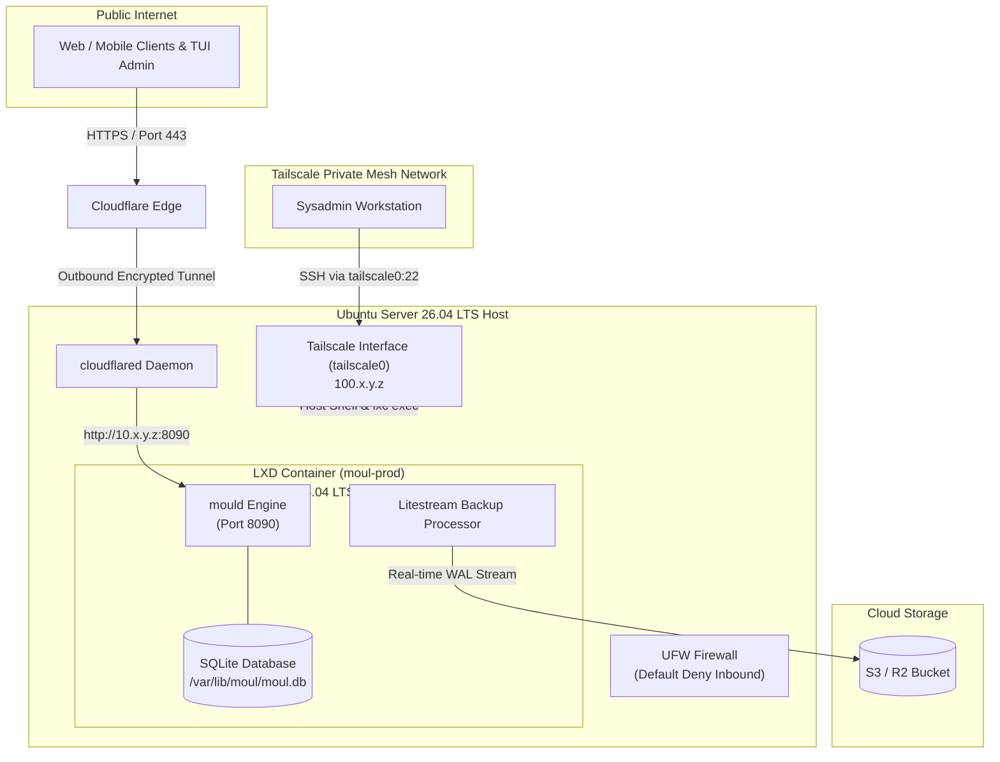

# Production Deployment Guide: LXD (Ubuntu Server 26.04 LTS) with Tailscale & Cloudflare Tunnel

This guide provides a step-by-step walkthrough for deploying `mould` in a hardened production environment on **Ubuntu Server 26.04 LTS** using **LXD unprivileged containers**, **Tailscale** for host management, and **Cloudflare Tunnel (`cloudflared`)** for zero-trust public ingress.

---

## 1. System Architecture



### Key Security & Architecture Benefits

1. **Zero Open Public Host Ports**: Cloudflare Tunnel establishes outbound connections to Cloudflare edges. Public inbound ports 80, 443, and 22 on the host's public IP are completely closed.
2. **Tailscale Host Management**: All SSH connections, server management, and `lxc exec` commands occur exclusively over the encrypted Tailscale private mesh network.
3. **Unprivileged LXD Container Isolation**: The `mould` application runs inside a lightweight, unprivileged Ubuntu 26.04 LTS container with CPU, RAM, and disk quotas.
4. **Litestream Automated Disaster Recovery**: Real-time SQLite Write-Ahead Log (WAL) streaming to S3/R2 storage ensures point-in-time recovery.

---

## 2. Step 1: Install & Configure Tailscale on the Host Machine

Install Tailscale on the **Ubuntu Server 26.04 LTS host** *before* locking down host firewall rules, ensuring uninterrupted administration access.

```bash
# Install Tailscale on the Ubuntu 26.04 LTS host machine
curl -fsSL https://tailscale.com/install.sh | sudo sh

# Connect host to your Tailnet
sudo tailscale up --hostname=ubuntu26-moul-host

# Get the host's internal Tailscale IPv4 address
tailscale ip -4
# Example output: 100.110.20.30
```

### Verify Host SSH Access Over Tailscale

Open a new terminal session from your workstation and verify you can connect to the host via Tailscale:

```bash
ssh user@100.110.20.30
```

---

## 3. Step 2: Firewall Hardening (UFW)

Once SSH connectivity over Tailscale is verified, configure `ufw` to drop all inbound traffic from the public network interface and allow SSH strictly over the `tailscale0` network interface.

```bash
# Set default firewall policies
sudo ufw default deny incoming
sudo ufw default allow outgoing

# Allow SSH strictly over the Tailscale network interface
sudo ufw allow in on tailscale0 to any port 22 proto tcp

# Enable UFW firewall
sudo ufw enable

# Verify UFW status
sudo ufw status verbose
```

*Note: Public SSH (port 22 on `eth0`/public IP) and ports 80/443 are now completely blocked from the internet.*

---

## 4. Step 3: LXD Host Initialization & Container Setup

### 1. Initialize LXD on Host

Initialize LXD on the Ubuntu 26.04 LTS host with default storage pool (ZFS/dir/btrfs) and bridge networking (`lxdbr0`):

```bash
# Initialize LXD with recommended production settings
sudo lxd init --auto
```

### 2. Launch Unprivileged LXD Container

Launch a clean Ubuntu 26.04 LTS system container named `moul-prod`:

```bash
sudo lxc launch ubuntu:26.04 moul-prod
```

### 3. Apply Resource Limits & Container Settings

Configure container autostart on host boot, along with CPU and Memory resource limits:

```bash
# Enable autostart on system boot
sudo lxc config set moul-prod boot.autostart true

# Set resource limits (adjust according to your workload)
sudo lxc config set moul-prod limits.cpu 2
sudo lxc config set moul-prod limits.memory 2GiB
```

### 4. Create Host Persistent Storage for SQLite Data

Create a dedicated directory on the host for the SQLite database files and mount it into the LXD container:

```bash
# Create directory on host
sudo mkdir -p /var/lib/moul-host-data

# Set ownership for unprivileged container user (mapping root subuid 100000)
sudo chown -R 100000:100000 /var/lib/moul-host-data

# Attach host disk mount to LXD container
sudo lxc config device add moul-prod moul-data disk \
  source=/var/lib/moul-host-data \
  path=/var/lib/moul
```

---

## 5. Step 4: Deploy `mould` inside LXD Container

Enter the LXD container shell:

```bash
sudo lxc exec moul-prod -- bash
```

### 1. Create Dedicated Application System User

Inside `moul-prod`:

```bash
# Create dedicated system user and group
sudo useradd -r -s /bin/false -d /var/lib/moul moul
sudo mkdir -p /var/lib/moul /etc/moul
sudo chown -R moul:moul /var/lib/moul /etc/moul
```

### 2. Install `mould` Binary

Download or transfer the pre-built `mould` Linux binary to `/usr/local/bin/mould`:

```bash
# Install binary and set executable permissions
sudo chmod +x /usr/local/bin/mould
sudo /usr/local/bin/mould version
```

### 3. Create Environment Configuration File

Create `/etc/moul/moul.env`:

```env
# Application Environment Settings
MOUL_ENV=production
MOUL_PORT=8090
MOUL_DB_PATH=/var/lib/moul/moul.db
MOUL_PUBLIC_URL=https://api.myapp.com
MOUL_ADMIN_KEY=your-secure-production-admin-key-here
MOUL_JWT_SECRET=your-secure-production-jwt-secret-here
MOUL_CORS_ORIGINS=https://myapp.com,https://admin.myapp.com

# Automated Litestream S3 Disaster Recovery Replication
LITESTREAM_ENABLED=true
LITESTREAM_S3_BUCKET=my-production-moul-backups
LITESTREAM_ACCESS_KEY_ID=YOUR_AWS_OR_S3_ACCESS_KEY
LITESTREAM_SECRET_ACCESS_KEY=YOUR_AWS_OR_S3_SECRET_KEY
LITESTREAM_REGION=us-east-1
# Optional: LITESTREAM_S3_ENDPOINT=https://s3.us-east-1.amazonaws.com
```

Set secure permissions on the environment file:

```bash
sudo chown moul:moul /etc/moul/moul.env
sudo chmod 600 /etc/moul/moul.env
```

### 4. Configure Systemd Service Unit

Create `/etc/systemd/system/moul.service`:

```ini
[Unit]
Description=Moul Dynamic Database & Engine
After=network.target

[Service]
Type=simple
User=moul
Group=moul
WorkingDirectory=/var/lib/moul
EnvironmentFile=/etc/moul/moul.env
ExecStart=/usr/local/bin/mould start
Restart=always
RestartSec=5s

# Security Hardening Directives
ProtectSystem=full
ProtectHome=true
PrivateTmp=true
NoNewPrivileges=true
ReadWritePaths=/var/lib/moul
LimitNOFILE=65536

[Install]
WantedBy=multi-user.target
```

Enable and start `moul.service`:

```bash
sudo systemctl daemon-reload
sudo systemctl enable --now moul

# Check service logs and status
sudo systemctl status moul
```

---

## 6. Step 5: Configure Cloudflare Tunnel (`cloudflared`)

Install `cloudflared` on either the host machine or inside a dedicated container to handle public HTTPS traffic routing to `mould`.

### 1. Install `cloudflared`

On Ubuntu 26.04 LTS:

```bash
# Add Cloudflare gpg key and package repository
sudo mkdir -p /etc/apt/keyrings
curl -fsSL https://pkg.cloudflare.com/cloudflare-main.gpg | sudo tee /etc/apt/keyrings/cloudflare-main.gpg >/dev/null
echo "deb [signed-by=/etc/apt/keyrings/cloudflare-main.gpg] https://pkg.cloudflare.com/cloudflared noble main" | sudo tee /etc/apt/sources.list.d/cloudflared.list

# Update package list and install cloudflared
sudo apt update && sudo apt install -y cloudflared
```

### 2. Authenticate & Create Cloudflare Tunnel

```bash
# Login to Cloudflare account
cloudflared tunnel login

# Create tunnel for moul production
cloudflared tunnel create moul-production
# Output will show the Tunnel ID, e.g.: 12345678-abcd-1234-abcd-1234567890ab
```

### 3. Create Cloudflare Tunnel Config

Get the IP address of the `moul-prod` LXD container:

```bash
sudo lxc list moul-prod
# Example container IP: 10.12.34.56
```

Create `/etc/cloudflared/config.yml`:

```yaml
tunnel: 12345678-abcd-1234-abcd-1234567890ab
credentials-file: /etc/cloudflared/12345678-abcd-1234-abcd-1234567890ab.json

ingress:
  - hostname: api.myapp.com
    service: http://10.12.34.56:8090
  - service: http_status:404
```

### 4. Route DNS & Install Service

```bash
# Route DNS hostname to Cloudflare Tunnel
cloudflared tunnel route dns moul-production api.myapp.com

# Install and start systemd service for cloudflared
sudo cloudflared service install
sudo systemctl enable --now cloudflared
```

---

## 7. Operational Maintenance & Cheat Sheet

### Host & Container Operations (via Tailscale)

Connect to host via Tailscale SSH:

```bash
ssh user@100.110.20.30
```

#### Container Management & Logs

```bash
# Check container status
sudo lxc list

# View live application logs
sudo lxc exec moul-prod -- journalctl -u moul -f

# View live cloudflared logs
sudo systemctl status cloudflared -l
```

#### Manual Database Backup & Snapshot

```bash
# Take LXD container state snapshot before updates
sudo lxc snapshot moul-prod snap-pre-upgrade

# List snapshots
sudo lxc info moul-prod
```

#### Database Disaster Recovery

To restore a database state from Litestream S3 backup onto a new LXD container:

```bash
sudo lxc exec moul-prod -- /usr/local/bin/mould restore
```
