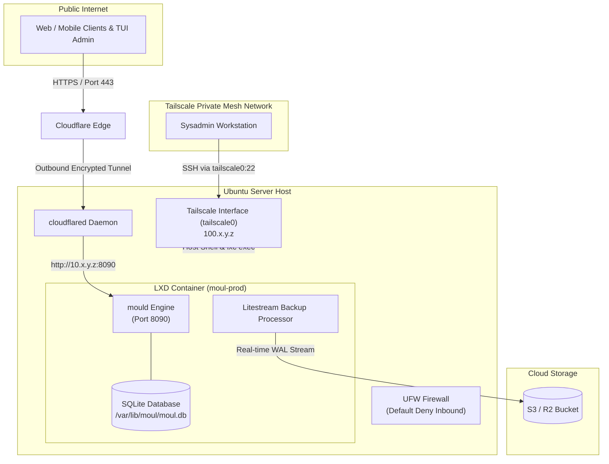

import { Step, Steps } from 'fumadocs-ui/components/steps'
import { Callout } from 'fumadocs-ui/components/callout'
import { Tab, Tabs } from 'fumadocs-ui/components/tabs'

This guide walks through deploying `mould` in a hardened production environment on **Ubuntu Server** using **unprivileged LXD system containers**, **Tailscale** for private host management, and **Cloudflare Tunnel (`cloudflared`)** for zero-trust public HTTPS ingress.

---

## Architecture Overview



### Key Security Benefits
1. **Zero Open Public Inbound Ports**: Firewall drops public SSH (22) and HTTP/HTTPS (80/443).
2. **Tailscale Host Operations**: SSH and LXD container administration (`lxc exec`) are isolated to the `tailscale0` network interface.
3. **Cloudflare Ingress**: Public API clients connect securely via Cloudflare Tunnel over HTTPS with automated SSL.
4. **Litestream Replication**: Built-in point-in-time SQLite replication to S3/R2 storage.

---

## Deployment Steps

<Steps>
<Step>
### Install & Configure Tailscale on Host

```bash
# Install Tailscale on Ubuntu host
curl -fsSL https://tailscale.com/install.sh | sudo sh

# Authenticate host to Tailnet
sudo tailscale up --hostname=moul-prod-host

# Check internal Tailscale IP
tailscale ip -4
```
</Step>

<Step>
### Firewall Hardening (UFW)

Lock down public ingress while allowing Tailscale and the LXD bridge:

```bash
sudo ufw default deny incoming
sudo ufw default allow outgoing

# Allow SSH strictly over Tailscale interface
sudo ufw allow in on tailscale0 to any port 22 proto tcp

# Allow LXD bridge interface
sudo ufw allow in on lxdbr0
sudo ufw route allow in on lxdbr0
sudo ufw route allow out on lxdbr0

# Enable firewall
sudo ufw enable
```
</Step>

<Step>
### Launch Unprivileged LXD Container

```bash
# Initialize LXD (if not already initialized)
sudo lxd init --auto

# Launch Ubuntu container
lxc launch ubuntu:24.04 moul-prod

# Apply CPU and RAM limits
lxc config set moul-prod limits.cpu 2
lxc config set moul-prod limits.memory 2GiB
```
</Step>

<Step>
### Install Moul & Run Service Inside Container

```bash
# Enter container shell
lxc exec moul-prod -- bash

# Download moul binary
curl -fsSL https://moul.dev/install.sh | sh

# Configure environment and systemd service...
```
</Step>

<Step>
### Configure Cloudflare Tunnel (`cloudflared`)

On the host machine, route traffic from your public domain to the LXD container's internal IP (`http://10.x.y.z:8090`):

```yaml
# /etc/cloudflared/config.yml
tunnel: <TUNNEL_UUID>
credentials-file: /etc/cloudflared/<TUNNEL_UUID>.json

ingress:
  - hostname: api.yourdomain.com
    service: http://10.x.y.z:8090
  - service: http_status:404
```

Start cloudflared:
```bash
sudo systemctl enable --now cloudflared
```
</Step>
</Steps>
