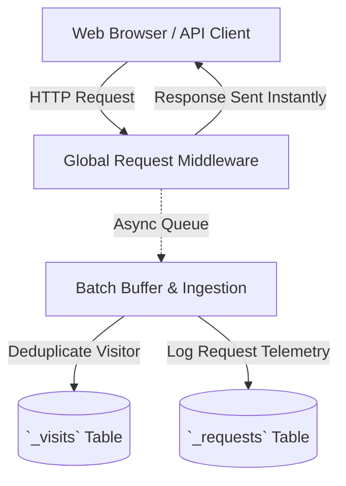

import { Tab, Tabs } from 'fumadocs-ui/components/tabs'
import { Callout } from 'fumadocs-ui/components/callout'

Inspired by Ruby's Ahoy, Moul includes a first-party analytics and telemetry engine that stores all metrics directly in your local SQLite database without third-party tracking scripts or cookies.

---

## Architecture & Data Flow



### 1. Zero-Latency Request Logging (`_requests`)
Every incoming HTTP request is tracked automatically by global middleware. Request method, path, HTTP status code, response time in microseconds, and IP address are buffer-batched and written asynchronously to SQLite with zero impact on request latency.

### 2. Visitor Session Deduplication (`_visits`)
Unique visitors are resolved using persistent session tokens. Moul automatically parses HTTP headers to extract:
- **Operating System** (e.g. macOS, Linux, Windows, iOS, Android)
- **Browser & Version** (e.g. Chrome, Firefox, Safari)
- **Device Category** (Desktop, Mobile, Tablet)
- **Referring Domain**
- **Marketing UTM Parameters** (`utm_source`, `utm_medium`, `utm_campaign`, `utm_term`, `utm_content`)
- **GeoIP Location** (City, Country, Latitude, Longitude) when `GEOIP_DB_PATH` is configured.

---

## Creating Dynamic Analytic Collections

Create an `analytic` collection to track custom business events (e.g. signups, purchases, feature clicks):

```json
{
  "name": "events",
  "type": "analytic",
  "schema": [
    { "name": "name", "type": "text", "required": true },
    { "name": "properties", "type": "json" },
    { "name": "amount", "type": "number" }
  ]
}
```

---

## Tracking Custom Events from Frontend

```typescript
// Send custom analytics event to Moul
await fetch('http://localhost:8090/api/moul/events/records', {
  method: 'POST',
  headers: { 'Content-Type': 'application/json' },
  body: JSON.stringify({
    name: 'plan_purchased',
    amount: 49.00,
    properties: {
      tier: 'pro',
      billing: 'annual'
    }
  }),
});
```

---

## Analytics Endpoints

- `GET /api/visits` — Paginated list of visitor sessions with browser, OS, device, UTM, and GeoIP data. Requires auth or admin key.
- `GET /api/requests` — Paginated list of recent HTTP request logs (method, path, status, latency). Requires auth or admin key.
- `GET /api/system/metrics` — Live host CPU usage, RAM utilization, disk space, and active Go goroutines. Requires auth or admin key.
