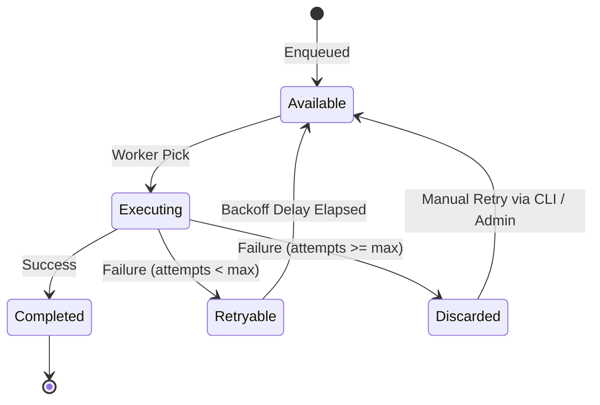

import { Tab, Tabs } from 'fumadocs-ui/components/tabs'
import { Callout } from 'fumadocs-ui/components/callout'

Inspired by Elixir's **Oban**, Moul provides a high-performance background job engine backed directly by SQLite. It eliminates external broker dependencies like Redis or RabbitMQ.

---

## Job Lifecycle & State Transitions



### Job States

- **`available`**: Job is queued and ready for worker pickup.
- **`executing`**: Currently being processed by a worker goroutine.
- **`completed`**: Finished successfully.
- **`discarded`**: Exhausted all retry attempts or cancelled manually (moved to DLQ).

---

## Automatic Retries & Exponential Backoff

```text
delay = (attempt^2 * 10) + 10 seconds + jitter
```

| Attempt | Minimum Delay |
| :---: | :---: |
| 1 | ~20 seconds |
| 2 | ~50 seconds |
| 3 | ~100 seconds (1.6 min) |
| 4 | ~170 seconds (2.8 min) |
| 5 | ~260 seconds (4.3 min) |

---

## Enqueueing Jobs

### Via REST API

Enqueue a job by inserting a record into any collection with `type: "worker"`:

<Tabs items={['cURL', 'TypeScript', 'Go']}>
  <Tab value="cURL">
```bash
curl -X POST "http://localhost:8090/api/moul/tasks_queue/records" \
  -H "X-Admin-Key: test-admin-key-1234" \
  -H "Content-Type: application/json" \
  -d '{
    "worker": "SendEmailNotification",
    "priority": 1,
    "max_attempts": 10,
    "args": {
      "to": "user@example.com",
      "template": "welcome_email",
      "userId": "usr_9921"
    }
  }'
```
  </Tab>
  <Tab value="TypeScript">
```typescript
const res = await fetch('http://localhost:8090/api/moul/tasks_queue/records', {
  method: 'POST',
  headers: {
    'X-Admin-Key': 'test-admin-key-1234',
    'Content-Type': 'application/json',
  },
  body: JSON.stringify({
    worker: 'SendEmailNotification',
    priority: 1,
    args: { to: 'user@example.com' },
  }),
});
```
  </Tab>
  <Tab value="Go">
```go
// Using internal worker package or pkg/app
job, err := workerEngine.Enqueue(ctx, "tasks_queue", map[string]any{
    "worker": "SendEmailNotification",
    "priority": 1,
    "args": map[string]any{
        "to": "user@example.com",
    },
})
```
  </Tab>
</Tabs>

---

## Immediate Signal Dispatch

Moul does not rely exclusively on periodic database polling tickers. Enqueueing a job immediately emits an in-memory channel signal, waking up idle worker goroutines with sub-millisecond dispatch latency.

---

## Dead-Letter Queue (DLQ) & CLI Management

When jobs fail repeatedly and exceed `max_attempts`, they enter the `discarded` state. You can inspect and retry discarded jobs directly via the CLI:

```bash
# 1. List all failed/discarded jobs in a queue
moul worker list-failed tasks_queue

# 2. Retry all failed jobs in the queue
moul worker retry tasks_queue

# 3. Retry a specific job by ID
moul worker retry tasks_queue job_01JXYZ123
```
