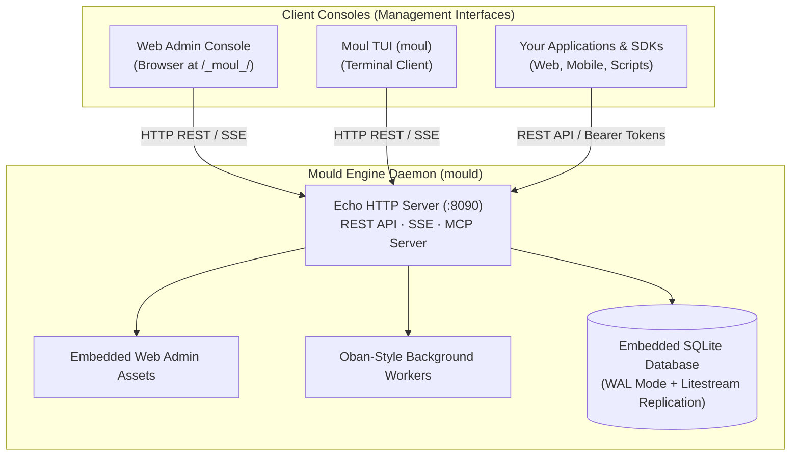

import { Card, Cards } from 'fumadocs-ui/components/card'
import { Callout } from 'fumadocs-ui/components/callout'
import { Tab, Tabs } from 'fumadocs-ui/components/tabs'
import { Server, Terminal, LayoutDashboard, ArrowRightLeft, ShieldCheck, Database, Cpu } from 'lucide-react'

Moul is designed around a clean separation of concerns: a **single headless daemon engine (`mould`)** that manages data, background jobs, authentication, and real-time streams, paired with **two dedicated client interfaces (`moul` TUI and the Web Admin Console)** to inspect and administer it.

---

## The Three Core Components



---

### 1. `mould` — The Engine Daemon

`mould` is the core backend daemon. When you run `mould start`, it initializes your SQLite database, starts the Echo HTTP/REST API server on port `:8090`, launches the background worker queue engine, activates real-time Server-Sent Events (SSE), and serves the static assets for the Web Admin Console.

- **Primary Role**: Server engine & background runtime.
- **Key Responsibilities**:
  - SQLite database management with dynamic runtime schema alterations.
  - Multi-factor authentication (Password, Email OTP, Passkeys, OAuth2).
  - Background worker pool with exponential retry and dead-letter queues.
  - Real-time Server-Sent Events (SSE) subscriptions.
  - Built-in Model Context Protocol (MCP) server for AI assistants.
  - First-party visitor analytics and optional GeoIP lookup.
- **CLI Usage**:
  ```bash
  mould start               # Start the engine daemon (default: :8090)
  mould seed                # Seed demo collections, records, and feature flags
  mould typegen             # Generate TypeScript types from schemas
  mould test-rule           # Evaluate and benchmark access rule expressions
  mould worker list-failed  # Inspect dead-letter queue (DLQ)
  mould worker retry        # Retry failed background worker jobs
  mould mcp                 # Start native MCP server over stdio
  mould restore             # Point-in-time restore from S3/Litestream backup
  mould update              # Self-update binary to latest release
  ```

---

### 2. `moul` — The Terminal Client (TUI)

`moul` is an interactive, keyboard-driven Terminal User Interface built with Charm's Bubble Tea. It connects to a running `mould` server (locally or over the network via HTTP/HTTPS) and provides full administrative control without needing a web browser.

- **Primary Role**: Terminal-native client for managing `mould`.
- **Key Responsibilities**:
  - Browse dynamic collections and inspect schema definitions.
  - Live record CRUD (search, filter, view formatted JSON, edit, create, delete).
  - Background worker queue monitor (live statuses, DLQ inspection, job retries).
  - Host and runtime health telemetry monitoring.
  - Trigger server-side hot-reloads of configuration.
- **CLI Usage**:
  ```bash
  # Connect interactively (prompts for URL and Admin Key)
  moul

  # Or connect directly with flags:
  moul -server http://localhost:8090 -admin-key your-admin-key

  # Update TUI client to latest release:
  moul update
  ```

---

### 3. Web Admin Console — The Browser Dashboard

The Web Admin Console is a single-page web application embedded directly inside the `mould` binary and served at `http://localhost:8090/_moul_/`.

- **Primary Role**: Browser-based graphical management dashboard.
- **Key Responsibilities**:
  - Visual drag-and-drop schema designer and field configuration.
  - Full-screen interactive data tables with search, sorting, and pagination.
  - Live charts for request throughput, latency percentiles, and error rates.
  - Real-time SSE live log stream viewer.
  - OpenFeature feature flags playground and rule targeting validator.
  - System settings and SMTP/S3 credentials manager.
- **Access**:
  Navigate to `http://localhost:8090/_moul_/` in any modern web browser and log in with your root administrative credentials or master `MOUL_ADMIN_KEY`.

---

## Comparison: When to Use What?

| Capability / Scenario | `mould` (Daemon & CLI) | `moul` (TUI Console) | Web Admin Console |
| :--- | :---: | :---: | :---: |
| **Run local server & APIs** | <span className="text-emerald-500 font-bold">✔ Primary</span> | — | — |
| **Headless / Remote SSH Admin** | ✔ CLI commands | <span className="text-emerald-500 font-bold">✔ Best experience</span> | — (requires port forward) |
| **Visual Schema Modeling** | — | Read-only inspection | <span className="text-emerald-500 font-bold">✔ Visual builder</span> |
| **Data Browsing & Editing** | Via HTTP API / cURL | ✔ Fast keyboard navigation | ✔ Rich visual data grid |
| **Background Queue DLQ Retries** | `mould worker retry` | ✔ Interactive | ✔ Interactive |
| **Live Telemetry & Graphs** | `/api/system/metrics` | ✔ Terminal gauges | <span className="text-emerald-500 font-bold">✔ Interactive charts</span> |
| **Feature Flags Playground** | `mould test-rule` | — | <span className="text-emerald-500 font-bold">✔ Live evaluator</span> |
| **CI/CD & Scripting** | <span className="text-emerald-500 font-bold">✔ CLI subcommands</span> | — | — |

---

## How Consoles Connect to `mould`

Both the **Web Admin Console** and **`moul` TUI** communicate with `mould` through its standard REST API and Server-Sent Events endpoints:

```text
  ┌────────────────────────────────────────────────────────┐
  │                   Management Consoles                  │
  │   [ Web Admin (/_moul_/) ]     [ TUI Client (moul) ]   │
  └───────────────┬────────────────────────┬───────────────┘
                  │                        │
     HTTP REST    │                        │  HTTP REST
     & Live SSE   │                        │  & Live SSE
                  ▼                        ▼
  ┌────────────────────────────────────────────────────────┐
  │                 mould Engine Server                    │
  │                  (Default: :8090)                      │
  │                                                        │
  │  • Authenticates via:                                  │
  │    - Master Key (X-Admin-Key / ?adminKey=...)          │
  │    - Root User JWT Token (_rootUsers)                  │
  │                                                        │
  │  • Endpoints:                                          │
  │    - /api/moul/*       (Collections, Schemas & CRUD)   │
  │    - /api/system/*     (Host Metrics & Collector)      │
  │    - /api/analytics/*  (Visitor Telemetry)             │
  │    - /api/mcp          (Model Context Protocol)        │
  └────────────────────────────────────────────────────────┘
```

<Callout type="info">
  **Remote Management Ready**: Because `moul` connects via standard HTTP REST, you can run `mould` on a remote production server and administer it locally from your laptop using `moul -server https://api.yourdomain.com -admin-key <key>`.
</Callout>

---

## Next Steps

- **[Quick Start Guide](/docs/getting-started/quickstart)**: Install Moul and start your local engine in 2 minutes.
- **[Configuration & Environment](/docs/getting-started/configuration)**: Complete guide to environment variables and runtime settings.
- **[Admin Consoles Guide](/docs/features/admin-consoles)**: Detailed walkthrough and keybindings for the Web Admin and TUI.
